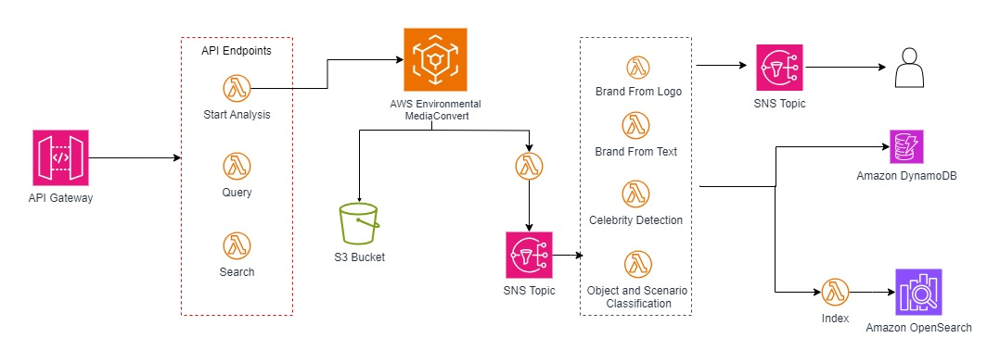

# Media Intelligence Video Analysis Solution with Terraform

This solution provides a **Media Intelligence Video Analysis** layer to identify and index specific elements in video content. It serves as a foundation for applications such as:

- Ad slot identification and insertion (e.g., [Smart Ad Breaks](https://github.com/aws-samples/aws-smart-ad-breaks)).
- Digital product placement for branding solutions.
- Media content moderation.
- Media content classification.

## License Summary

This documentation is licensed under the Creative Commons Attribution-ShareAlike 4.0 International License. See the LICENSE file for more details.  
The sample code is licensed under the MIT-0 license. See the LICENSE-SAMPLECODE file.

---

## Solution Architecture

This Terraform-based deployment provisions the following architecture:



- **S3 Buckets**: For input video files and processed outputs.
- **Amazon Rekognition**: For video analysis, including optional custom label training and celebrity recognition.
- **DynamoDB**: To store analysis results.
- **OpenSearch**: For indexing and searching video metadata.
- **API Gateway and Lambda**: To expose RESTful APIs for video analysis operations.

---

## 1. Prerequisites

1. **AWS CLI**: Installed and configured on your local machine.
2. **Terraform**: Installed on your system. Follow [Terraform Installation Guide](https://developer.hashicorp.com/terraform/tutorials/aws-get-started/install-cli).
3. **Amazon S3 Buckets**: Create two buckets:
   - **Input Bucket**: To store videos for analysis.
   - **Output Bucket**: To store the processed files.

---

## 2. Optional Pre-Deployment Configuration

### Create a Face Collection in Rekognition

If using the **Celebrity Recognition Model**, create a face collection:

1. Create a folder (`/faces`) with images of celebrities.
2. Follow the [Rekognition Face Collection Guide](https://docs.aws.amazon.com/rekognition/latest/dg/collections.html) to create and populate the collection.
3. Note the **Collection ID** for use in the deployment.

---

### Train a Custom Labels Model in Rekognition

For brand detection:

1. Create a folder (`/brands/samples`) with brand logos.
2. Upload the folder to the **Input Bucket**.
3. Follow these steps:
   - [Create a Project](https://docs.aws.amazon.com/rekognition/latest/customlabels-dg/cp-create-project.html).
   - [Create a Dataset](https://docs.aws.amazon.com/rekognition/latest/customlabels-dg/cd-manifest-files.html).
   - Replace `<S3_BUCKET>` in `output.manifest` with your bucket name.
   - [Train the Model](https://docs.aws.amazon.com/rekognition/latest/customlabels-dg/tm-console.html).
   - [Start the Model](https://docs.aws.amazon.com/rekognition/latest/customlabels-dg/rm-run-model.html).
4. Note the **Model ARN** for use in the deployment.

---

## 3. Deployment with Terraform

to spin up this repository, begin by editing the tfvars file with the corresponding values

```
# terraform.tfvars
cognito_domain_name    = "media-intelligence-domain-test"
email                  = "themail@gmail.com"
s3_bucket              = "media-convert-input-bucket-11132024"
destination_bucket     = "media-convert-output-bucket-11132024"
es_domain_name         = "aprendiendoaws-ml-mi-domain"
dynamodb_table_name    = "aprendiendoaws-ml-mi-jobs"
stage_name             = "Prod"
osc_dictionary         = "osc_files/dictionary.json"

```

### 3.1 Clone the Repository

```bash
git clone <repository_url>
cd <repository_directory>
```

### 3.2 Initialize Terraform

```bash
terraform init
```

### 3.3 Validate Terraform Code

```bash
terraform validate
```


### 3.4 Apply Terraform Config

```bash
terraform apply
```

When prompted, enter yes

```
Do you want to perform these actions? 
  Terraform will perform the actions described above.
  Only 'yes' will be accepted to approve.

Enter a value: yes
```
Terraform will output the API Gateway endpoint which you can use to test or use the API

## 4 Using the API

### 4.1 Start Video Analysis
The is to begin an Analysis on a given video. Ensure that the `S3Key` is an existing video you have already uploaded into the input s3 bucket. This enpoint will upload the video as a job in Amazon Environmental Video Convert, and store it's output image frames into the Output s3 bucket.

```
POST /analysis/start
{
  "S3Key": "video-file.mp4",
  "SampleRate": 1,
  "analysis": ["osc", "bft"]
}
```

### 4.2 Retrieve Analysis Results

To retrieve the results of the analysis, you can  make a request to `/analysis` using the format of the payload below. The `JobId` is the ID that was given as response in the analysis request.

```
POST /analysis
{
  "S3Key": "video-file.mp4",
  "JobId": "MediaConvertJobId",
  "analysis": "bft"
}

```

### 4.3 Search through Analysis 

You can even search through the analysis results. The search feature is why we have elasticsearch.

```
POST /analysis/search
{
  "must": {
    "scenes": [{"scene": "Sports", "accuracy": 50.0}]
  },
  "avoid": {
    "sentiments": [{"sentiment": "sadness", "accuracy": 89.0}]
  },
  "S3Key": "video-file.mp4",
  "SampleRate": 1
}

```

## Destroy Infrastructure

To clean up the Infrastructure, execute the command below


```
terraform destroy --auto-approve
```